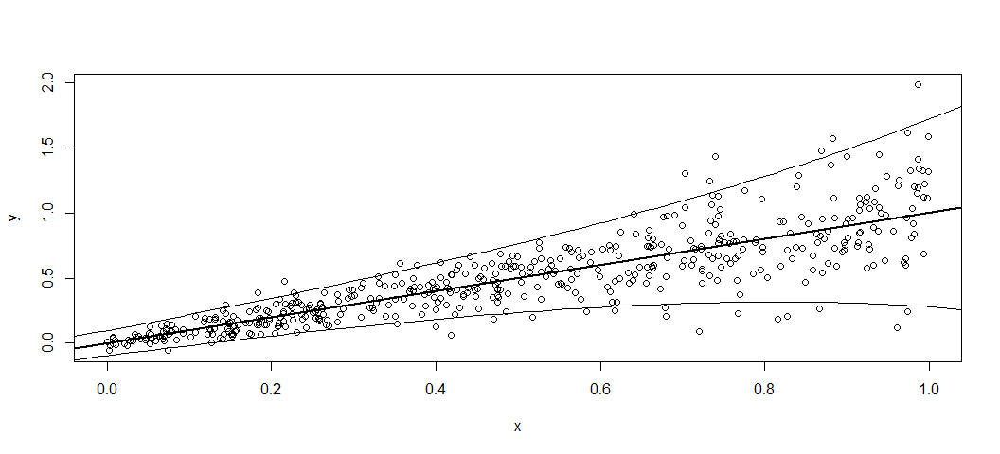
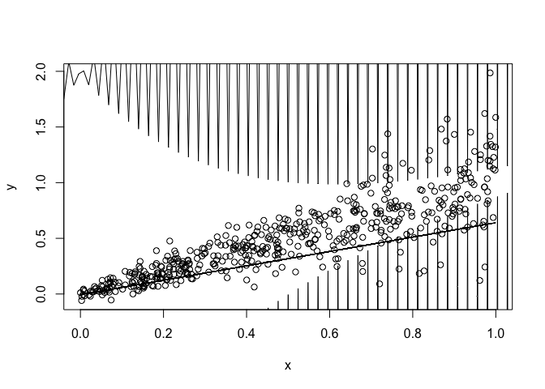

<!-- README.md is generated from README.Rmd. Please edit that file -->

# asp20boost

  - Supervisor: Thomas Kneib
  - Students: Johannes, Levin, Sebastián
  - Topic: Parameter estimation and variable selection using the
    boosting ensemble learning algorithm

## Tasks

### until \~ 11 May

  - simple boost function for scale (estimate var(yi))
  - read Wickham “R-Packages”
  - try implementing function-testing
  - get used to roxygen2

## Literature

  - Section **4.3** on “Boosting Linear Regression Models” in
    “Regression: Models, methods, and applications” by Ludwig
    Fahrmeir, Thomas Kneib, Stefan Lang, and Brian Marx
  - Section **2.9.1** on “Regression models for location, scale, and
    shape” in ibd.

<!--
more datasets:
- gamlss.data::TODO
- MASS::Boston
- https://archive.ics.uci.edu/ml/datasets.php
-->

## Location Scale Regression Model

``` r
n <- 500
x <- runif(n)
y <- x + rnorm(n, sd = exp(-3 + 2 * x))
plot(x, y)
abline(0, 1, lwd = 2)
curve(x + 1.96 * exp(-3 + 2 * x), -0.1, 1.1, add = TRUE)
curve(x - 1.96 * exp(-3 + 2 * x), -0.1, 1.1, add = TRUE)
```



## Location Scale Regression Boost Model

``` r
library(asp20boost)
model <- LocationScaleRegressionBoost$new(y ~ x, ~ x)
gradient_boost(model, 
              stepsize = 0.001, maxit = 1000,
              abstol = 0.001,
              verbose = FALSE)
#> boost js
plot(x, y)
lines(x,model$fitted_location)
#Todo do create similar graphic
curve(x + 1.96 * exp(x*model$gamma), -0.1, 1.1, add = TRUE)
#> Warning in x * model$gamma: longer object length is not a multiple of shorter
#> object length
curve(x - 1.96 * exp(x*model$gamma), -0.1, 1.1, add = TRUE)
#> Warning in x * model$gamma: longer object length is not a multiple of shorter
#> object length
```


